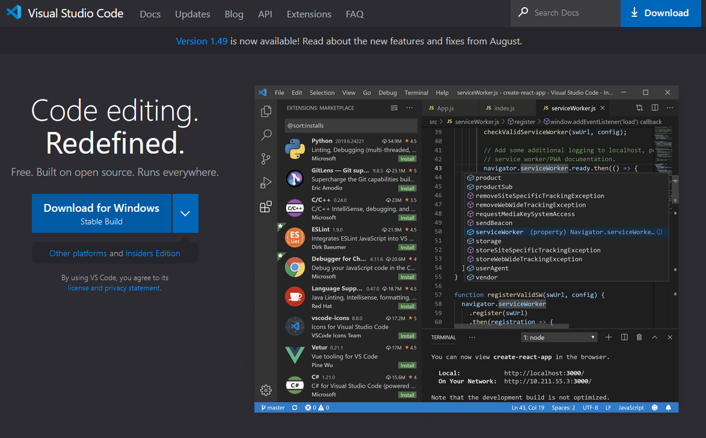

# Website Analysis

All websites are different because they serve different purposes. However, they share common structural elements,
both on their visual aspect and their code.

Most websites have their logos on the top left corner or the top center. The navigation is either on a top bar or on a
left column (or right-to-left languages is similar but on the other side). This is called consistency and you can see
it everywhere: a VW Golf and a Porsche are cars made for different purposes but they have a steering wheel on the left
side, three pedals and a shift stick (OK, they can have two pedals if they're automatic but they don't have 5 pedals and
a joystick).

Here we can review different websites, the audience they serve and the common structure elements they share. We will see
later that most of these elements are variations of a few HTML tags.

# What We Need

## Visual Studio Code

Visual Studio Code is a lightweight but powerful source code editor which runs on your desktop and is available for
Windows, macOS and Linux. It comes with built-in support for JavaScript, TypeScript and Node.js and has a rich
ecosystem of extensions for other languages (such as C++, C#, Java, Python, PHP, Go) and runtimes (such as .NET)
You can learn more and also download it from [https://code.visualstudio.com/](https://code.visualstudio.com/).

## Browser

There are many browsers in the market: Chrome, Firefox, Safari, Opera, Internet Explorer, Edge and a few other ones. We
will use Google Chrome, which is the most popular at the moment and a solid product. If you don't have it installed, you
can download it from [https://www.google.com/chrome/](https://www.google.com/chrome/).

## A good folder structure

We will follow conventions to make it is easier for each of us to see and understand the different projects. We will
create a folder called ReDI HTML&CSS Lessons and inside that folder we will make one new folder per project. Each
project folder will have two extra folders; one for all the images, called img and one for the css files. At root level
(that is, inside the project folder) we will have the different HTML files.

## Microsoft Teams

There are many communication tools, but we officially chose Microsoft Teams. There we have a channel for the class where
we can share materials, examples, links, updates about the classes etc. Everyone is on that channel so let's check if we have
it installed and is working. If it's not on your computer, you can download it from [https://www.microsoft.com/en-us/microsoft-365/microsoft-teams/group-chat-software](https://teams.microsoft.com).

